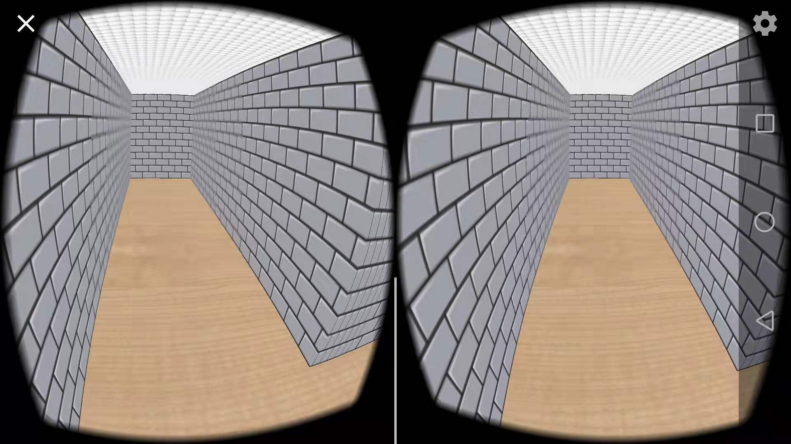

# 《迷宫》实验报告

## 实现内容

本项目在Google VR SDK的基础上开发了一个具有一定可玩性的迷宫游戏，所有代码在applications/maze目录下。主要完成内容包括：

- 随机合法迷宫生成与存储

- 游戏交互逻辑

- 物体的显示与贴图

- 音效的添加

下面详述各部分的实现方法

### 迷宫生成

迷宫生成作为一个经典问题，已经有不少成熟的算法。我则根据实际情况（目标是随机投放到迷宫的任何一处都存在到出口的路径）选择了随机Prim算法，其主要用到了并查集的数据结构。算法流程如下
~~~
1. 初始化n * m个格子，每个格子四周都是墙壁，每个格子自成一个集合。
2. 随机选择一面墙，如果它隔开的两个格子不是同一个集合，则消灭这堵墙。
3. 重复第2步，直到所有格子都属于同一个集合。
4. 随机打开一个边界上的格子通往边界外的墙，标记此处为终点。
~~~
在实现上，我则没有使用ppt上的方法。我认为一般的迷宫墙的厚度都远小于路的宽度，在这个前提下无法将墙看作为正方形。因此我不得不将墙分为横墙和竖墙分别进行存储和渲染。（横墙指X轴跨度大于Z轴跨度，竖墙相反）

### 游戏交互逻辑

这部分又分为几个部分：

 - **移动**
	我使用了比较自由的移动方式，除了人的Y轴（即眼睛高度不可变）人可以朝人眼所视中心移动任意距离，移动方式为按下一定时长屏幕，时间越久，移动越远，除非与墙体发生碰撞，才会导致移动失败。

 - **扭头**
	未做修改，使用SDK自带实现。
	
 - **双击**
	由于该迷宫可自定义大小，因此针对迷宫游戏难以找到解的问题我专门设计了一个标记来方便进行道路的查找。在某些分支路口或者是说死胡同，面向其双击可以凭空留下一个红色的叉（再次双击可取消），这样就可以一步步缩小查找范围，最终找到迷宫的解。

### 物体显示与渲染

这部分我大体沿用了Google VR SDK提供的Texture和TextureMesh类来实现物体的表示和贴图。
 - 在这过程中首先要解决的是加载进来的obj的变换方法（先缩放后旋转再平移），所有的墙体由基本的正方体变换而来。
 - 地板和房顶则是由正方形平面变换而来，使用了OpenGL中的重复贴图来实现内容的平铺。
 - 红色叉和绿色勾用带Alpha通道的PNG图片渲染得到，需要最后渲染以防其遮挡原来的内容。

### 音效添加

本游戏添加了始终伴随游戏始终的BGM[^1]，以及撞墙声、标记声、取消标记声和完成任务声[^2]。其中使用了MediaPlayer的方法实现了无缝的循环播放（com.google.vr.sdk.audio.GvrAudioEngine无法播放较长/较大音乐文件；直接设置完成回调时重新播放存在一定时间的延迟）：在播放第一个Player的时候同时初始化也就是准备第二个Player，当收到该Player结束的时候立马播放第二个Player，并开始准备第三个Player。这样就实现了无缝衔接。
[^1]:  出自网易云音乐：旅行青蛙 - 青蛙旅行BGM原声（第六宇宙 remix）
[^2]:  出自 http://www.aigei.com/

## 实验难点

 - 迷宫不使用一个数组存储较为繁琐。要考虑横竖墙的size不同，以及之间的缝隙等问题。
 - OpenGL入门。
 - 坐标变换较为陌生，Google VR SDK也没有提供详细的教程。

## 实验创新

 - 迷宫大小可变，难度递增（初始为4x4，每通过一次后长和宽随机增长1-2）。
 - 随机迷宫生成。
 - 具有标记功能，增强了游戏的"可"玩性。

## 调用库说明

 - android.media.MediaPlayer
	 - create：创建Player
	 - setOnPrepareListener：设置准备好媒体文件时的回调函数
	 - setOnCompletionListener：设置播放完媒体文件时的回调函数
	 - setNextMediaPlayer：设置下一个媒体文件
 - android.opengl.GLES20
	 - glTexParameterf(GLES20.GL_TEXTURE_2D, GLES20.GL_TEXTURE_WRAP_S, GLES20.GL_REPEAT) 与 glTexParameterf(GLES20.GL_TEXTURE_2D, GLES20.GL_TEXTURE_WRAP_T, GLES20.GL_REPEAT)：一起设置S和T方向上的重复贴图
	 - glEnable(GLES20.GL_BLEND)和glBlendFunc(GLES20.GL_ONE, GLES20.GL_ONE_MINUS_SRC_ALPHA)：支持渲染带ALPHA通道的PNG图片
 - android.opengl.Matrix
	 - setIdentity：赋值单位矩阵
	 - translateM：平移矩阵
	 - rotateM：旋转矩阵
	 - scaleM：缩放矩阵
	 - multiplyMM：矩阵乘矩阵
 - com.google.vr.sdk.audio.GvrAudioEngine
	 - createStereoSound：创建立体声资源
	 - playSound：播放声音资源
 - com.google.vr.sdk.base.HeadTransform
     - getForwardVector：获取视线朝向

## 部分游戏截图

普通场景

终点

死胡同

打上标记

