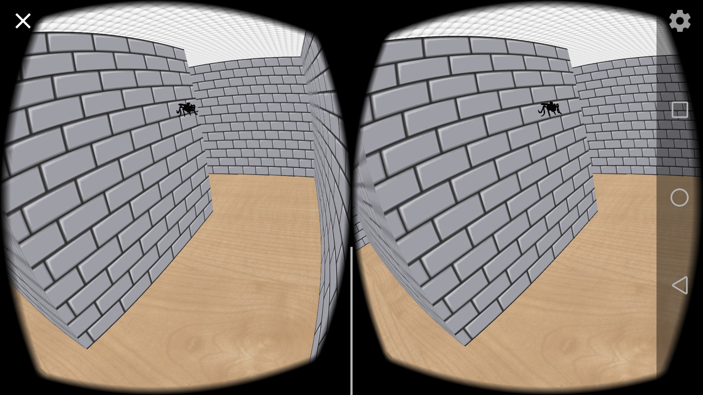

# 《找蚊子》实验报告

计65 赵鋆峰 2016011373

# 简要说明

本项目在《迷宫》的基础上实现了**实时**的3d蚊子音效，并且设计了蚊子的移动路径，使得玩家可以根据声音的实时变化来确定蚊子的移动、定位蚊子。

# 实现流程

## 数据预处理

我使用的是HRTF的方法，用的是CIPIC的公开数据集[^1]，因此需要将提供的[20] [50] [200]的数据导入到android，（提供的是matlab格式）。我选择用matlab编写脚本然后输出到文件，android运行时从raw/文件夹下一次性读取所有数据（使用bufferReader + parse方法只需两秒）。在这之中我们注意到提供的数据是在44100采样率下的，而我们的蚊子声是22050采样率，因此为了保持相同的采样率，200个点只保留一百个。同样蚊子的原始wav文件我们同样用matlab读取输出成采样文件用同样的方式加载。

## 音源处理

为了得到立体音效，我们需要计算HRTF中的azimuth和elevation参数，这个只需要将直角坐标系转化为球坐标系简单计即可。得到之后我们需要计算一个长度为100的卷积。保险起见我尝试了暴力计算和快速傅里叶变换（FFT）两种做法，FFT的实现我使用了开源Java库JTransformer[^2]。经过比较两者对于长度比较小的卷积速度上没有大区别，每一帧计算音效所花时间均为1-2毫秒。

我选择了用指数函数的倒数作为音频随距离削减的函数。

# 音源播放

计算得到的音效我使用了AudioTrack，使用其内置的MODE_STREAM模式，可以按顺序把计算得到的音频数据写入到缓冲区依次播放，并且直接支持立体音效的播放，写入缓冲区的数据为LRLRL...左右耳交替的形式。

# 蚊子路径

蚊子我使用了从网上下载得到了的obj文件进行渲染。为了模拟真实的蚊子移动路径，我采用的方法如下：

~~~
1. 初始化一个速度方向（归一化）
2. 随机在三维空间中选择一个归一化向量，将其缩放到固定长度之后与原速度方向叠加，并再次归一化
3. 在叠加得到的速度方向上移动固定长度的距离，如果得到的目标位置进入了墙内，则将速度方向在墙面上做反射（根据碰撞到的墙面来判断。保证不会进入墙内而且保留进入其他空间的可能性）
4. 重复第2步
~~~

具体实现时可以不用每帧都叠加方向，可以设置一个周期或者随机周期来改变方向。其中将随机得到的归一化向量再缩放是为了让原速度方向改变的幅度不至于过大，这个长度越小叠加的这个速度对原方向的影响越小。

实测音频效果可以满足需求。运行截图如下：

# 实验困难

在实验中遇到的困难主要是对音频数据处理的不熟悉，对于音频的处理方式、卷积的操作方式等都不熟悉、需要从零开始接触。

# 用到的库

除了之前迷宫用到的库之外，这次我还使用了Android自带的AudioTrack以及专门用于快速傅里叶变换的JTransformer库。

- android.media.AudioTrack
  - getMinBufferSize:得到初始化最小的buffer大小
  - write: 往buffer中写入要播放的数据，在MODE_STREAM模式下会有一定延时才播放
  - play: 开始播放buffer中的音频数据（播放之后仍然可以继续写数据）
  - setVolume: 同时设置左右声道的音量，大小为0-1
- org.jtransforms.fft.FloatFFT_1D
  - complexForward: 计算给定复数数组的DFT（复数数据存在float数组内部，一个复数用两个连续的float表示）
  - complexInverse:计算给定复数数组的IDFT
- android.opengl.Matrix
  - setLookAm: 用来得到蚊子在给定速度方向时要扭转朝向的model矩阵（调用之后求逆即得）

[^1]: https://github.com/Asues/Matlab
[^2]: https://sites.google.com/site/piotrwendykier/software/jtransforms